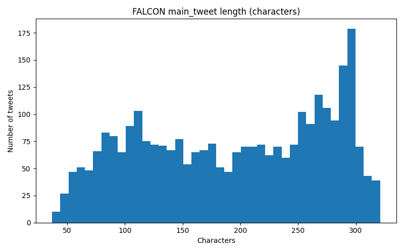
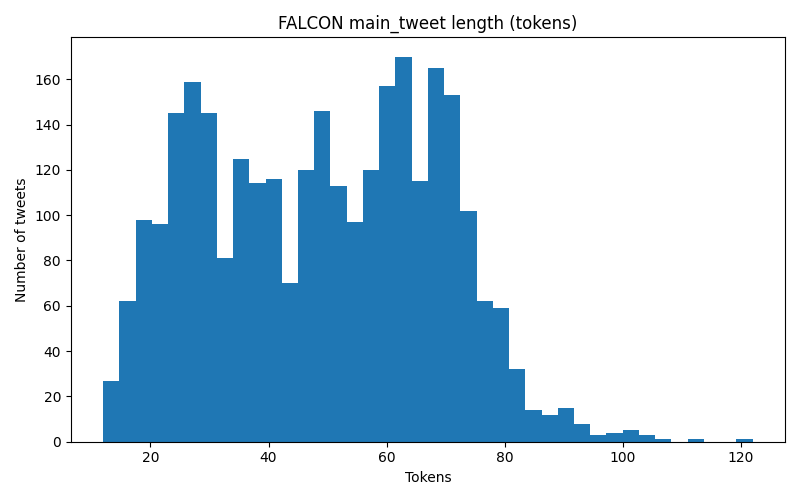
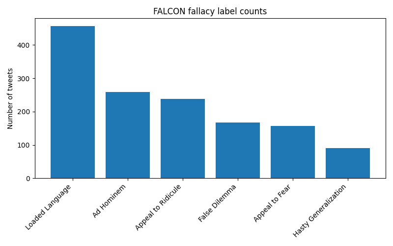
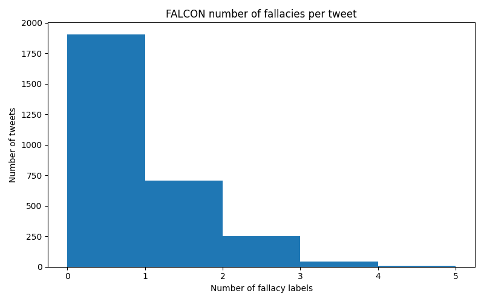
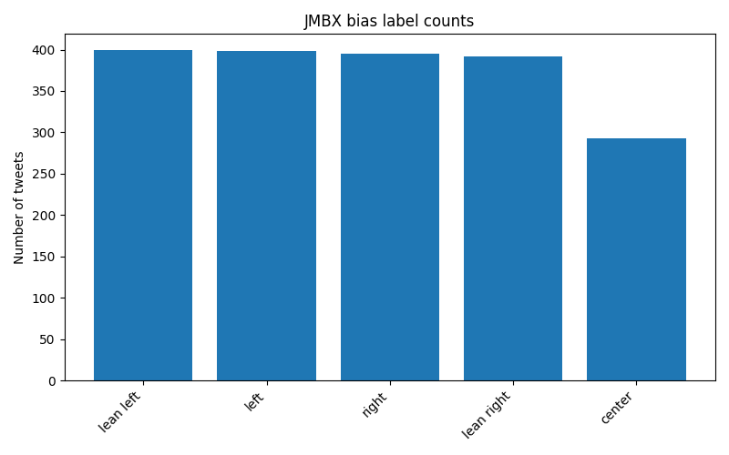
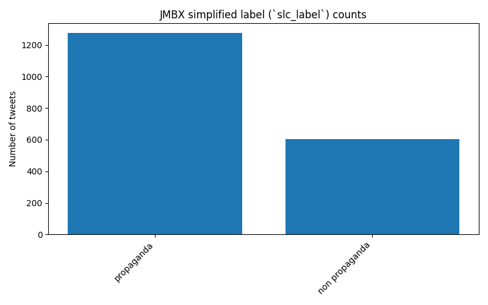
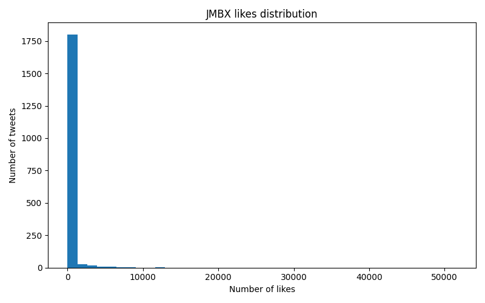
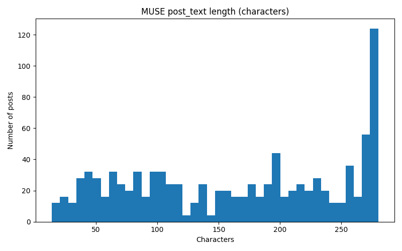
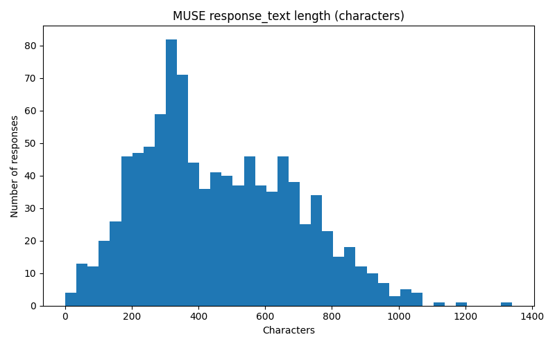
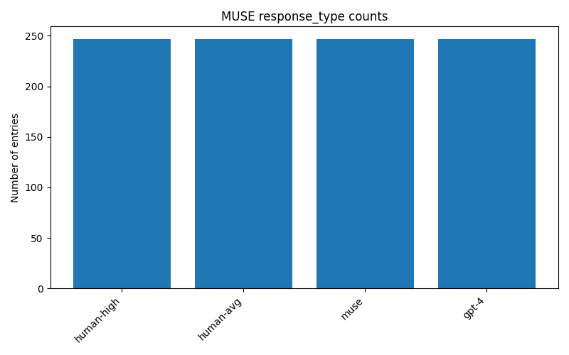

# Datasets – Exploratory Analysis

This report summarizes the exploratory data analysis (EDA) for the three datasets considered in our project:

- **FALCON** – fallacy-annotated COVID-19 tweets with conversation context and rich features.
- **JMBX** – tweet IDs with bias and propaganda labels plus engagement metadata.
- **MUSE subset** – original tweets and explanatory notes (human and model-generated).

We ultimately **use FALCON as the primary dataset** for downstream modeling and semantic web representation. JMBX and the MUSE subset are used for exploratory comparison and future extensions, but not as main training corpora, because full tweet text is not available at scale without paid X API access.

All quantitative summaries below are computed by `scripts/generate_dataset_stats.py` and plots are saved under `data/output/eda/figures/`.

---

## 1. FALCON dataset

### 1.1 Overview and relation to the project

FALCON (Fallacies in COVID-19 Network-based) is a **multi-label, graph-based dataset** of COVID-19-related tweets annotated for six fallacy types:

- Ad Hominem
- Appeal to Fear
- Appeal to Ridicule
- False Dilemma
- Hasty Generalization
- Loaded Language

For each tweet, annotators provide a binary flag per fallacy and a `None of the above` indicator. The dataset also includes conversation context (`previous_context`, `posterior_context`), user and engagement metadata, and engineered features (hashtags, mentions, sentiment, POS counts).

From `dataset_stats.md`:

- **Files:** `df_train.csv`, `df_val.csv`, `df_test.csv`
- **Annotated tweets:** **2,916** (sum across all splits)
- This matches the number reported in the FALCON README, so **we have the full annotated dataset**.

This fits our project very well: fallacy labels can be mapped directly to the persuasion techniques in our ontology (e.g., `Loaded Language` → `LoadedLanguage`, `Appeal to Fear` → `FearAppeal`).

### 1.2 Text length distributions

We focus on the `main_tweet` field, which is the text actually annotated for fallacies.

From the length statistics:

- **Characters** (`main_tweet`)
  - Count: 2,916
  - Min: 37
  - Max: 321
  - Mean: ≈ 194
  - Median: 201
- **Tokens** (`main_tweet`, tiktoken `cl100k_base` tokens)
  - Count: 2,916
  - Min: 12
  - Max: 122
  - Mean: ≈ 49
  - Median: 50

This shows that texts are **medium-length tweets**: mostly between 150–250 characters and around 50 model tokens. This length range is convenient both for LLM-based analysis and for building RDF representations without excessively long literals.

Visualizations:

These histograms show a unimodal distribution centered around ≈200 characters and ≈50 tokens.

### 1.3 Fallacy label distribution and co-occurrence

The multi-label fallacy counts (across all tweets) are:

- `Loaded Language`: 457
- `Ad Hominem`: 259
- `Appeal to Ridicule`: 238
- `False Dilemma`: 168
- `Appeal to Fear`: 157
- `Hasty Generalization`: 91

Observations:

- **Loaded Language is the most common fallacy**, matching intuition that emotionally charged wording is pervasive in online COVID-19 discourse.
- **Ad Hominem** and **Appeal to Ridicule** are also frequent, reflecting personal attacks and mocking tone.
- **Hasty Generalization** is rarer, suggesting that explicit over-generalization is less common or harder to annotate.

Visualizations:

The bar chart highlights the dominance of `Loaded Language`, while the histogram of fallacies per tweet shows a strong peak at 0–1 with a long tail up to 4.

### 1.4 Choice of fields and processed dataset

For our main pipeline we currently keep only:

- `main_tweet`
- six fallacy columns (`Ad Hominem`, `Appeal to Fear`, `Appeal to Ridicule`, `False Dilemma`, `Hasty Generalization`, `Loaded Language`)
- `None of the above`

in a processed file `data/output/processed/falcon_processed.csv` generated by `scripts/process_datasets.py`. Other fields (context, engagement, engineered features) are kept in the raw CSVs and can be reintroduced later for richer modeling (e.g., temporal or graph-based analysis), but are not required for Milestone 2.

### 1.5 Suitability for the project

Given its **full availability offline**, explicit fallacy labels, and manageable size, **FALCON is selected as our primary dataset** for:

- Training and evaluating persuasion-technique detection models.
- Generating RDF graphs that encode posts, techniques, and their relations to entities.
- Serving as the “real” part of our planned **half-real, half-synthetic** corpus (synthetic texts can later be generated to augment specific techniques or topics).

---

## 2. JMBX dataset

### 2.1 Overview

The JMBX dataset in this project contains **1,877** rows (see `dataset_stats.md`) with the following key columns:

- `ID` – tweet identifier (Twitter status ID).
- `Number of Likes(favor)` – likes/favorites count.
- `Retweet Count` – retweet count.
- `Is retweeted` – whether the record itself is a retweet.
- `bias` – ideological bias (e.g. `left`, `lean left`, `right`, `lean right`, `center`).
- `label` – list-style string representing propaganda techniques.
- `slc_label` – simplified label (e.g. `propaganda` vs `non propaganda`).

Crucially, the **tweet text is not present** in the local CSV – only tweet IDs. In the original paper this dataset is meant to be used by rehydrating text from Twitter, but in our setting that would require X API access.

### 2.2 Label distributions

The **bias distribution** is relatively balanced:

- `lean left`: 399
- `left`: 398
- `right`: 395
- `lean right`: 392
- `center`: 293

This gives a roughly symmetric coverage of left/right/center biases, which is helpful for studying how propaganda is distributed across ideological positions.

Visualization:

For the **simplified label** (`slc_label`):

- `propaganda`: 1,274
- `non propaganda`: 603

So approximately **two thirds of tweets are labeled as propaganda**, giving a reasonably balanced but clearly persuasion-focused dataset.

Visualization:

The `label` column (not explicitly summarized here) contains more fine-grained propaganda techniques and could later be manually mapped to our ontology (e.g., some techniques corresponding to fear appeal, scapegoating, etc.).

### 2.3 Engagement distributions

The numeric summaries for engagement are:

- **Likes** (`Number of Likes(favor)`)
  - Count: 1,877
  - Min: 0
  - Max: 51,584
  - Mean: ≈ 278
  - Median: 16
- **Retweets** (`Retweet Count`)
  - Count: 1,877
  - Min: 0
  - Max: 49,469
  - Mean: ≈ 145
  - Median: 5

The high maximum and low median indicate a **heavy-tailed distribution**: a small number of viral tweets and many low-engagement ones.

Visualizations:

These histograms show a dense mass near zero with a long tail extending to tens of thousands of engagements.

### 2.4 Limitations and role in the project

Because the local JMBX file contains **only tweet IDs and labels**, to obtain text we would need to **rehydrate tweets via the X API**. In the current API regime this is not practical for a full dataset:

- The free tier typically allows on the order of **100 posts per day**.
- The first paid tier costs **≈175 USD/month**, which is not feasible for this course project.

Therefore, we currently treat JMBX as:

- A source of **label distributions and engagement statistics** (used in this EDA).
- A potential basis for **synthetic tweet generation**, where we could sample propaganda techniques and biases and generate texts with an LLM, creating a synthetic counterpart to the real FALCON tweets.

We do **not** use JMBX as a primary dataset for our models at this stage, but its labels can later be **manually mapped** to our ontology and aligned with FALCON/MUSE techniques.

---

## 3. MUSE subset

### 3.1 Overview

The MUSE (Misinformation correction Using Structured Explanations) framework focuses on tweets paired with structured corrections (e.g. Community Notes-style explanations). In our project, we have a **local subset of 988 entries** (`MUSE_dataset.csv`) with the following main columns:

- `post_text` – text of the original tweet/post.
- `response_text` – explanatory or corrective response.
- `response_type` – {`human-high`, `human-avg`, `muse`, `gpt-4`}.
- `annotated` – whether the entry is marked as annotated/valid.

Unlike JMBX, this file already contains both **tweet and note text**, but it is a relatively small subset compared to the larger MUSE dataset described in the paper.

### 3.2 Length distributions: posts vs notes

From `dataset_stats.md`:

- **`post_text` length (characters)**
  - Count: 988
  - Min: 14
  - Max: 280
  - Mean: ≈ 164
  - Median: 173
- **`post_text` length (tokens, tiktoken `cl100k_base`)**
  - Count: 988
  - Min: 3
  - Max: 74
  - Mean: ≈ 36
  - Median: 38

So posts are typical tweets near the 280-character limit.

- **`response_text` length (characters)**
  - Count: 988
  - Min: 1
  - Max: 1,339
  - Mean: ≈ 458
  - Median: 427
- **`response_text` length (tokens, tiktoken `cl100k_base`)**
  - Count: 988
  - Min: 1
  - Max: 366
  - Mean: ≈ 108
  - Median: 101

Notes are **much longer than the original posts**—roughly three times longer on average. This matches their explanatory role: they provide context, corrections, and evidence.

Visualizations:

These histograms clearly show a shift toward longer texts for `response_text`.

### 3.3 Response types and annotation quality

The `response_type` distribution is perfectly balanced in our subset:

- `human-high`: 247
- `human-avg`: 247
- `muse`: 247
- `gpt-4`: 247

Visualization:

This balanced split is ideal for comparing **human vs model-generated** explanations in terms of style, length, and (later) perceived quality.

For the `annotated` flag:

- `Y`: 941
- `N`: 47

Most entries are marked as annotated/valid, leaving a small subset to be filtered out if needed.

### 3.4 Limitations and role in the project

The original MUSE paper uses a significantly larger dataset constructed from Twitter. In this project we only have a **small, self-contained subset** with 988 pairs of (post, note). Scaling up would again require rehydrating a large number of tweets via the X API, facing the same constraints as JMBX (free tier of ≈100 posts/day or paid tier at ≈175 USD/month).

Given these limitations, we use the MUSE subset to:

- Understand the **structure and style** of explanatory notes.
- Inspire our **semantic web representation** of corrections and evidence.
- Provide a small evaluation set contrasting human vs LLM explanations.

However, for training and large-scale experiments we rely on **FALCON as the main source of text** and plan to adapt the MUSE framework (i.e., generate structured explanations and RDF) to FALCON-like posts rather than attempting to fully rehydrate MUSE.

---

## 4. Cross-dataset considerations and label unification

Each dataset uses its own annotation scheme:

- **FALCON** – explicit fallacy labels (Ad Hominem, Appeal to Fear, Loaded Language, etc.).
- **JMBX** – ideological bias plus propaganda techniques (in `label`) and a binary `slc_label` (`propaganda` / `non propaganda`).
- **MUSE subset** – focuses on **corrections** and explanation types (`response_type`), not fallacies in the original posts.

Despite these differences, the datasets are **compatible at the conceptual level**:

- Many JMBX propaganda techniques correspond to fallacies or persuasion strategies present in our ontology (e.g. appeals to authority, fear, or scapegoating).
- FALCON fallacies can be directly mapped to our core persuasion technique classes.
- MUSE’s explanations can be annotated with which fallacy or technique they address.

In future work we can **manually define a mapping between label sets** (e.g. “propaganda with fear-based content” → `FearAppeal`, “strongly evaluative wording” → `LoadedLanguage`), enabling cross-dataset analysis and a unified semantic web representation.

For now, however, **FALCON remains our only fully usable dataset** for large-scale modeling, while JMBX and the MUSE subset serve as auxiliary resources for label design, evaluation, and potential synthetic data generation.